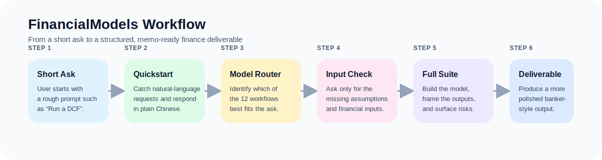

# FinancialModels

Codex skills for financial modeling workflows, with a focus on fast model routing, structured intake, and polished Chinese-language deliverables.

## What is in this repository?

This repository currently ships two complementary Codex skills:

- `financial-modeling-suite`
  A full 12-model financial analysis router with input checklists, model-selection logic, and Chinese banker-style output templates.
- `financial-modeling-quickstart`
  A lightweight front door for short, conversational prompts such as `run a DCF`, `跑 DCF`, or `做个三张表`.

Together, these skills help Codex:

1. identify which financial model the user actually needs,
2. ask only for the missing inputs,
3. avoid inventing numbers too early, and
4. produce outputs that read more like investment banking / private equity working materials.

## Workflow at a glance



The quickstart skill catches rough asks, the suite gathers only the missing inputs, and the final output is shaped into a more decision-ready finance deliverable.

## Supported models

The suite currently supports 12 workflows:

1. DCF valuation model
2. Three-statement financial model
3. M&A accretion / dilution analysis
4. LBO model
5. Comparable company analysis
6. Precedent transaction analysis
7. IPO valuation and pricing analysis
8. Credit analysis and debt capacity model
9. Sum-of-the-parts valuation
10. Operating model and unit economics
11. Sensitivity and scenario analysis
12. Investment committee memo

## Repository structure

```text
FinancialModels/
├── README.md
├── CHANGELOG.md
├── LICENSE
├── CONTRIBUTING.md
├── SECURITY.md
├── financial-modeling-suite/
│   ├── SKILL.md
│   ├── agents/
│   │   └── openai.yaml
│   └── references/
│       ├── models.md
│       └── templates-zh.md
├── financial-modeling-quickstart/
│   ├── SKILL.md
│   └── agents/
│       └── openai.yaml
├── docs/
│   ├── README.md
│   ├── installation.md
│   ├── zh-user-guide.md
│   ├── sample-output.md
│   └── assets/
│       ├── usage-flow.svg
│       ├── model-routing.svg
│       └── output-stack.svg
├── examples/
│   ├── invocation-examples.md
│   ├── input-template.md
│   └── release-checklist.md
└── .github/
    ├── CODEOWNERS
    ├── ISSUE_TEMPLATE/
    └── pull_request_template.md
```

## Installation

Copy one or both skill folders into your Codex skills directory:

```bash
mkdir -p ~/.codex/skills
cp -R financial-modeling-suite ~/.codex/skills/
cp -R financial-modeling-quickstart ~/.codex/skills/
```

If you already manage skills in another location, place the folders wherever your Codex setup expects local skills to live.

## Documentation

If you are new to the repository, start here:

- [Documentation index](./docs/README.md)
- [Installation guide](./docs/installation.md)
- [Chinese user guide](./docs/zh-user-guide.md)
- [Sample output guide](./docs/sample-output.md)

## How to invoke the skills

### Explicit invocation

Use the skill name directly in your prompt:

```text
$financial-modeling-suite Build a DCF for PDD Holdings and tell me which data is still missing.
```

```text
$financial-modeling-quickstart 跑 DCF
```

### Natural-language invocation

The quickstart skill is designed to catch short requests such as:

- `跑 DCF`
- `做个三张表`
- `看下这个收购增厚吗`
- `拉个 LBO`
- `出个投委会 memo`

## Typical workflow

### 1. Start with a rough ask

```text
跑 DCF
```

### 2. Let the skill collect missing inputs

Expected intake pattern:

- identify the model,
- explain what the model answers,
- ask for required inputs only,
- optionally offer to produce an illustrative draft with explicit assumptions.

### 3. Move into a structured output

Once enough data is present, the suite can produce:

- checklist-driven working models,
- banker-style Chinese summaries,
- investment committee style writeups,
- scenario and sensitivity tables.

## Recommended use cases

These skills work especially well for:

- investors and analysts who want faster first-pass models,
- founders preparing fundraising materials,
- operators building budgeting or scenario models,
- Chinese-language users who want more polished finance-style output.

## Included examples

See the [`examples/`](./examples) folder for:

- common invocation patterns,
- copy/paste input templates,
- a lightweight release checklist for packaging or publishing future updates.

## Notes

- These skills are designed for analytical decision support, not personalized investment advice.
- Public-company data, market rates, peer multiples, and precedent transactions are time-sensitive and should be refreshed before final use.
- The Chinese templates are intentionally more structured and presentation-ready than a normal assistant response.
