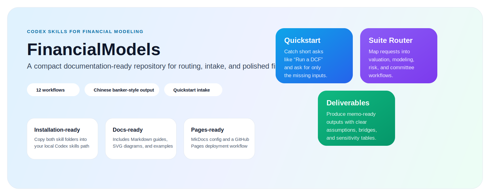

  
CODex Skills for Finance Workflows

  <h1>FinancialModels Documentation</h1>
  

    Route rough finance asks into structured workflows, collect only the missing inputs,
    and produce more polished banker-style deliverables.
  

  

    <a class="md-button md-button--primary" href="./installation/">Install the skills</a>
    <a class="md-button" href="./zh-user-guide/">Read the Chinese guide</a>
    <a class="md-button" href="./sample-output/">See sample output</a>
  

  

    <h2>Start fast</h2>
    
Use the quickstart layer for prompts like <code>跑 DCF</code>, <code>做个三张表</code>, or <code>出个投委会 memo</code>.

  

  

    <h2>Route correctly</h2>
    
Move into the full suite when you need one of the 12 supported modeling, valuation, or decision-support workflows.

  

  

    <h2>Deliver better</h2>
    
Generate assumption-aware Chinese outputs that feel closer to working finance materials than a generic assistant answer.

  

## Workflow overview

## Why this project exists

FinancialModels is meant to make high-friction finance workflows feel lighter without turning them into black boxes. The goal is not to hide assumptions. The goal is to make them easier to collect, easier to label, and easier to communicate.

  

    <h2>For users</h2>
    <ul>
      <li>Install the skills locally</li>
      <li>Start with a natural-language request</li>
      <li>Let the router ask only for missing inputs</li>
      <li>Move into a structured finance deliverable</li>
    </ul>
  

  

    <h2>For contributors</h2>
    <ul>
      <li>Review the repository docs and examples</li>
      <li>Improve routing, templates, or examples</li>
      <li>Validate behavior before opening a PR</li>
      <li>Keep output quality and assumption hygiene high</li>
    </ul>
  

## Model routing at a glance

## Recommended reading path

1. [Installation guide](./installation.md)
2. [Chinese user guide](./zh-user-guide.md)
3. [Sample output guide](./sample-output.md)

  

    <h2>Ready to try it?</h2>
    
Install both skills, start with a quick ask, and then move into the full suite when you need a more formal output.

  

  

    <a class="md-button md-button--primary" href="./installation/">Get started</a>
    <a class="md-button" href="https://github.com/MichaelRochonnn/FinancialModels">Open the repository</a>
  

## Related repository docs

- [GitHub folder README](https://github.com/MichaelRochonnn/FinancialModels/blob/main/docs/README.md)
- [Top-level README](https://github.com/MichaelRochonnn/FinancialModels/blob/main/README.md)
- [Examples directory](https://github.com/MichaelRochonnn/FinancialModels/tree/main/examples)
- [Contributing guide](https://github.com/MichaelRochonnn/FinancialModels/blob/main/CONTRIBUTING.md)
- [Security policy](https://github.com/MichaelRochonnn/FinancialModels/blob/main/SECURITY.md)
- [Changelog](https://github.com/MichaelRochonnn/FinancialModels/blob/main/CHANGELOG.md)
