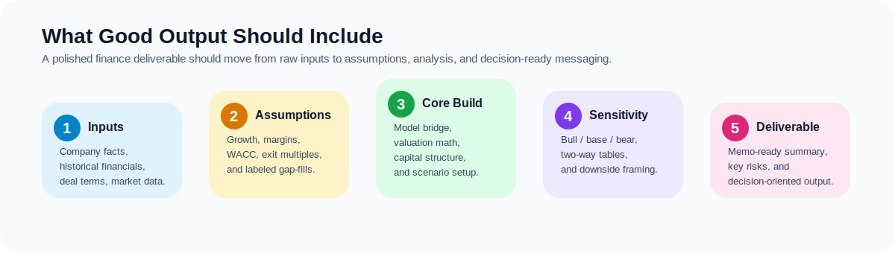

# Sample Output Guide

This document shows what a good interaction and a good deliverable should look like.

## Visual overview



A strong deliverable should make it obvious how the work moved from inputs and assumptions to a decision-ready summary.

## Example 1: Quickstart intake flow

### User prompt

```text
跑 DCF
```

### Expected assistant behavior

A good response should:

- identify that the user wants a DCF valuation model,
- briefly explain what the model answers,
- ask for the minimum required inputs,
- optionally offer a draft model with explicit assumptions.

### Example response shape

```text
可以，你这次要跑的是：DCF 估值模型。

这个模型主要回答：这家公司基于未来现金流，大概值多少钱。

先给我这几个必填数据：
1. 公司名称、行业、主要市场
2. 最新一年收入、EBITDA 或 EBIT
3. Capex、折旧摊销、税率、营运资本变化
4. 净债务 / 现金、总股本
5. 未来 5 年的收入增长和利润率假设
6. WACC 输入

如果你想，我也可以先按行业常见假设给你跑一个示意版 DCF。
```

## Example 2: Structured Chinese DCF output

Once enough data is available, a polished deliverable should usually contain sections like these:

- valuation summary,
- historical operating snapshot,
- key assumptions,
- forecast bridge,
- terminal value,
- sensitivity tables,
- bull / base / bear cases,
- key risks and follow-up items.

### Example outline

```text
公司名称 | DCF 估值摘要 | 日期

一、结论先行
- 基准情景股权价值
- 对应每股价值 / 每 ADS 价值
- 估值区间来源

二、历史经营表现
- 收入
- EBIT / EBITDA
- 现金流
- 利润率趋势

三、核心假设
- 收入增长
- 利润率
- 税率
- Capex
- WACC
- 永续增长率 / 退出倍数

四、估值结果
- 显性期 FCF 现值
- 终值现值
- EV
- 净现金 / 净债务桥
- Equity Value

五、敏感性分析
- WACC × g
- WACC × exit multiple

六、风险与后续验证
- 最关键的 3 到 5 个变量
- 哪些地方需要用最新市场数据重跑
```

## Example 3: Asking for a draft with assumptions

### User prompt

```text
先跑一个示意版 DCF，不够的数据你按行业常见假设补，但要把假设单独列出来。
```

### Good behavior

The response should:

- clearly separate provided data from assumed data,
- label assumptions explicitly,
- avoid presenting assumed market inputs as if they were sourced facts,
- mention which items should be refreshed before final use.

## Example 4: Investment committee style output

### User prompt

```text
Use the full suite to produce a Chinese investment committee memo with a more formal PE-style structure.
```

### Good output shape

A strong investment committee style deliverable should usually include:

- executive summary,
- deal or company overview,
- industry framing,
- investment thesis,
- valuation summary,
- key risks,
- recommendation.

## Quality bar

A good output from this repository should feel:

- structured,
- specific,
- assumption-aware,
- easy to scan,
- closer to working finance materials than a generic assistant answer.

## Related docs

- [Documentation index](./README.md)
- [Chinese user guide](./zh-user-guide.md)
- [Invocation examples](../examples/invocation-examples.md)
- [Input templates](../examples/input-template.md)
