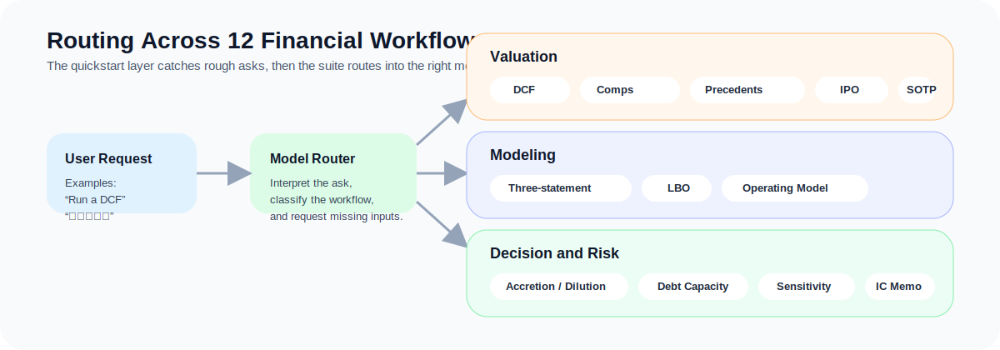

# 中文使用手册

这份文档面向想直接使用这两个 Skill 的中文用户。

## 一图看懂使用流程




上面两张图对应两个重点：

- 你怎么从一句口语化需求进入完整工作流
- 系统怎么把需求路由到 12 种不同的金融模型

## 这两个 Skill 分别做什么？

### `financial-modeling-quickstart`

这是一个更口语化的入口，适合你直接说：

- `跑 DCF`
- `做个三张表`
- `拉个 LBO`
- `做个 SOTP`
- `出个投委会 memo`

它的作用是先识别你想要哪种模型，再用更自然的中文提醒你还缺哪些关键信息。

### `financial-modeling-suite`

这是完整工作流版，适合你已经知道自己要跑什么模型，或者希望输出更结构化、更像投行 / PE 材料的时候使用。

它目前覆盖 12 类模型：

1. DCF 估值模型
2. 三张表财务模型
3. 并购增厚 / 摊薄分析
4. LBO 模型
5. 可比公司分析
6. 可比交易分析
7. IPO 定价分析
8. 债务承载能力模型
9. SOTP 分部估值
10. 经营模型与单位经济
11. 敏感性与情景分析
12. 投资委员会 Memo

## 推荐怎么用

### 方式一：先用口语化入口

先直接说你的需求：

```text
跑 DCF
```

或者：

```text
看下这个收购增厚吗
```

这时 quickstart 会先做两件事：

- 判断你实际要跑的模型
- 只问缺的关键输入

### 方式二：直接点名完整 Skill

如果你已经知道自己要哪个模型，也可以直接这样写：

```text
$financial-modeling-suite Build a DCF for PDD Holdings and tell me which inputs are still missing.
```

## 一个典型流程长什么样？

### 第一步：提出需求

```text
跑 DCF
```

### 第二步：Skill 收集缺失输入

通常会提醒你补：

- 公司名称、行业、地区
- 收入、EBITDA / EBIT
- Capex、折旧摊销、税率
- 营运资本、净债务 / 净现金、股本
- 未来 5 年增长和利润率假设
- WACC 输入

### 第三步：进入正式输出

当输入足够时，Skill 会开始生成更结构化的结果，例如：

- 假设总览
- 核心计算桥
- 估值结论
- 敏感性分析
- Bull / Base / Bear 情景
- 风险和需要继续验证的点

## 什么情况下适合让它先出示意版？

如果你手里的数据还不完整，可以明确告诉它：

```text
先跑一个示意版 DCF，不够的数据你按行业常见假设补，但要把假设单独列出来。
```

这样更适合：

- 先看框架
- 先和团队讨论方向
- 先做内部草稿

## 想让输出更像投行 / PE 材料，可以怎么说？

你可以直接追加要求：

```text
请用更像投行 memo 的结构输出。
```

或者：

```text
请按中文 PE 投委会材料的风格来写。
```

## 实用建议

- 不要一上来只说“帮我分析一下这家公司”，最好直接说模型名称或业务问题。
- 如果数据不全，让它先出示意版，但一定要求单列假设。
- 如果你需要更像正式材料，明确要求 banker-style / PE-style output。
- 对于上市公司估值、可比公司、可比交易、市场利率这类时间敏感数据，正式使用前要重新核验。

## 进一步参考

- [安装指南](./installation.md)
- [示例输出](./sample-output.md)
- [调用示例](https://github.com/MichaelRochonnn/FinancialModels/blob/main/examples/invocation-examples.md)
- [输入模板](https://github.com/MichaelRochonnn/FinancialModels/blob/main/examples/input-template.md)
